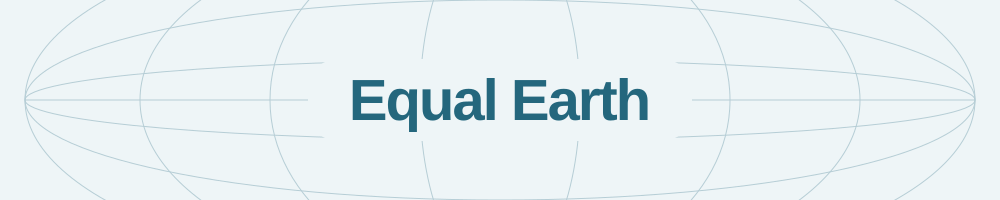
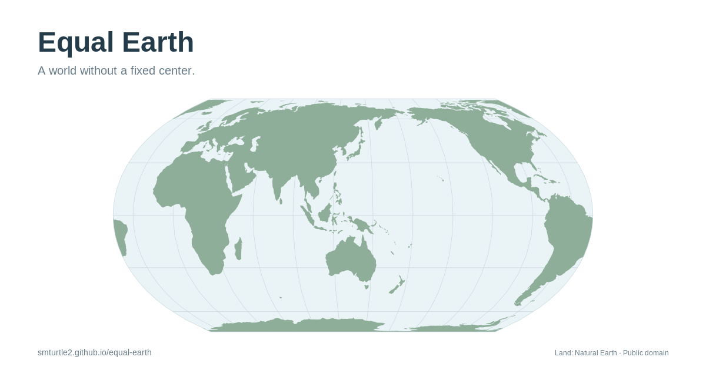
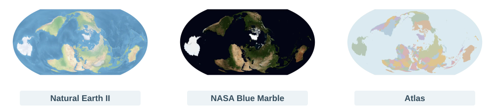

**Explore Equal Earth with fluid rotation and vivid textures.**

[**Open map ↗**](https://smturtle2.github.io/equal-earth/) · [한국어](docs/README.ko.md) · [Report an issue](https://github.com/smturtle2/equal-earth/issues)

[](https://github.com/smturtle2/equal-earth/actions/workflows/pages.yml)

[](LICENSE)



## Map styles



## Features

- **Free rotation** — drag, tilt, and roll the map around any point.
- **Synchronized globe** — explore the same orientation in flat and spherical views.
- **Map styles** — Natural Earth II, NASA Blue Marble, and Atlas, a country-colored map at 8192 × 4096 resolution.
- **Borders and names** — toggle national boundaries and upright country/capital labels together on any map style.
- **Mouse, touch, and keyboard** — rotate either view; zoom the flat map independently.

The interface follows your browser’s language preferences.

Requires a browser with WebGPU enabled.

## Controls

| Input | Action |
| --- | --- |
| Drag / arrow keys | Rotate the map and globe |
| Shift + drag / hold Q or E | Roll; Shift + Q/E increases speed |
| Scroll / pinch / + or − | Zoom the flat map |
| Two-finger gesture | Rotate, twist, and zoom |
| 0 / Home / double-click | Reset the view |
| Globe layer button | Toggle the graticule or current Earth texture |

The interface supports mouse, touch, and keyboard controls.

- **Location & coordinates:** use your location or enter `latitude, longitude`. Location permission is requested on click; your position is not saved.
- **Presets:** return to Balanced or choose a continent or pole. Southern-hemisphere presets put the South Pole above the center. Switching preserves zoom.
- **Map details:** toggle borders and country/capital names together. Labels stay upright; capitals appear as you zoom in.
- **PNG export:** save the current map at 4K with a transparent background, including visible borders and names. Controls and the small globe are excluded.

Regenerate map assets with `uv run --script tools/build_political_assets.py`. See [source details](public/layers/sources.json).

## Development

Use Node.js 24 or later.

```sh
npm ci
npm run dev
```

Built with TypeScript, Vite, WebGPU, and gl-matrix.

### Build and test

```sh
npm test
npm run build
npx playwright install chromium
npm run test:browser
```

Build output goes to `dist/`. Pushes to `main` deploy to GitHub Pages after tests pass; pull requests run checks only. See the [deployment workflow](.github/workflows/pages.yml).

## Credits & license

Earth imagery: [Natural Earth](https://www.naturalearthdata.com/) and [NASA Blue Marble](https://science.nasa.gov/earth/earth-observatory/blue-marble-next-generation/base-map/). Blue Marble uses the July 2004 composite.

Code and documentation: [EUPL-1.2](LICENSE). External assets retain their original terms; see [third-party notices](docs/THIRD_PARTY_NOTICES.md) and [texture sources](public/textures/sources.json).
